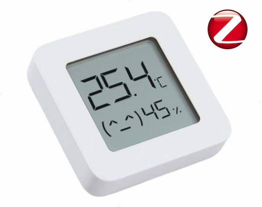

# Zigbee 3.0 Firmware for original LYWSD03MMC Sensor

This repository forked from [devbis/z03mmc](https://github.com/devbis/z03mmc) (!)

Актуальную версию смотрите в [devbis/z03mmc](https://github.com/devbis/z03mmc)!

Текущие тесты-задачи-дополнения:

1. Добавлена сборка проекта с помощью ‘make’ (Windows/linux) и возможность импорта 'Existing Project' в "Telink IoT Studio".

2. Малая оптимизация по потреблению - среднее потребление 19 мкА для Xiaomi LYWSD03MMC B1.4, при опросе 10 сек. 


3. Требуется разбор SDK для встраивания функции опроса датчика в событие обновления передачи.


Для сборки под Linux выполнить:

```
git clone https://github.com/pvvx/z03mmc
make install
make
```

Out log:
```
Warning: Undefined symbol 'ss_apsmeSwitchKeyReq'!
Warning: Undefined symbol 'ss_apsmeTransportKeyReq'!
Warning: Undefined symbol 'tl_zbNwkBeaconPayloadUpdate'!
===================================================================
 Section|          Description| Start (hex)|   End (hex)|Used space
-------------------------------------------------------------------
 ramcode|   Resident Code SRAM|           0|        1510|    5392
    text|           Code Flash|        1510|       1F2D4|  122308
  rodata| Read Only Data Flash|           0|           0|       0
 cusdata|          Custom SRAM|      8452E0|      8452E0|       0
      nc|   Wasteful Area SRAM|      841510|      841600|     240
   ictag|     Cache Table SRAM|      841600|      841700|     256
  icdata|      Cache Data SRAM|      841700|      841F00|    2048
    data|       Init Data SRAM|      841F00|      8420C8|     456
     bss|        BSS Data SRAM|      8420D0|      8452E0|   12816
 irq_stk|        BSS Data SRAM|      8420D0|      8422D0|     512
    cbss| Custom BSS Data SRAM|      8452E0|      8452E0|       0
   stack|       CPU Stack SRAM|      8452E0|      850000|   44320
   flash|       Bin Size Flash|           0|       1F49C|  128156
-------------------------------------------------------------------
Start Load SRAM : 0 (ICtag: 0x0)
Total Used SRAM : 21216 from 65536
Total Free SRAM : 240 + stack[44320] = 44560
```

Под Window, после импорта в ‘Telink IoT Studio’, выполнить “make install” или в папке проекта:
```
git clone https://github.com/devbis/tl_zigbee_sdk.git -b 3.6.8.5 --depth 1 ./SDK
```
И включить многопоточную сборку для сборки всего проекта с нуля за 2..3 сек (make -j -> 3 сек на 12-ти ядрах/24 потока).


---

This repository contains the Zigbee firmware for Xiaomi LYWSD03MMC Bluetooth temperature and humidity sensor.

## Overview



The LYWSD03MMC is a Bluetooth temperature and humidity sensor that can be integrated into a Zigbee network using
this firmware. This repository hosts the code and related resources to flash the device and make 
it compatible with Zigbee networks.

## Features
- Full-featured firmware to convert Xiaomi LYWSD03MC device with default ZCL battery, temperature and relative humidity clusters
- Display support for known revisions
- OTA support in firmware and binaries in ZCL format for update 
- Flashable over-the-air from custom ATC firmware https://pvvx.github.io/ATC_MiThermometer/TelinkMiFlasher.html
- Flashable over SWS-UART interface using one of:

  - https://pvvx.github.io/ATC_MiThermometer/USBCOMFlashTx.html
  - https://github.com/pvvx/ATC_MiThermometer/blob/master/TLSR825xComFlasher.py 
  - https://github.com/pvvx/TLSRPGM 

## Getting Started

### Prerequisites

- Zigbee compatible hardware (e.g., Zigbee coordinator or gateway).
- Necessary tools for flashing firmware to the sensor.

### Building firmware

1. Clone TC32 toolchain according to your host OS:
    ```sh
    git clone https://github.com/devbis/tc32.git -b linux
    ```
    ```sh
    git clone https://github.com/devbis/tc32.git -b macos
    ```
    ```sh
    git clone https://github.com/devbis/tc32.git -b windows
    ```

2. Clone this repository and SDK:

    ```sh
    git clone https://github.com/devbis/z03mmc.git
    git clone https://github.com/devbis/tl_zigbee_sdk.git -b 3.6.8.5 --depth 1
   
    cd z03mmc
    ```
   
3. Configure and build:
    ```sh
    cmake -DSDK_PREFIX=$(pwd)/../tl_zigbee_sdk -DTOOLCHAIN_PREFIX=$(pwd)/../tc32 -B build .
    cmake --build build --target z03mmc.zigbee
    ```

    Firmware binary is located at `build/src/z03mmc.bin`
    The binary with OTA header is at the same folder, ending with `z03mmc.zigbee`


## Flashing from a custom bluetooth firmware (easy way for new devices)
1. Open an awesome tool from ATC_MiThermometer https://pvvx.github.io/ATC_MiThermometer/TelinkMiFlasher.html
2. Click "Connect" button and find device LYWSD03MMC, wait connection (Connected in logs)
3. On new device with stock firmware click "Do Activation" and wait some time
4. Next "Select Firmware", choose file with custom bluetooth firmware [ATC_ota_400000](./assets/ATC_ota_40000.bin), click "Start Flashing"
5. You will see in logs "Update done after NN seconds"
6. Reboot device removing battery, refresh web-page with flashing tool and connect device again (with name ATC_802190 or similar, based on mac-address). Do not change any control on page
8. Flash latest [z03mmc.bin](https://github.com/devbis/z03mmc/releases) firmware over transitional firmware to convert it to zigbee. Use https://devbis.github.io/telink-zigbee/ page if previous flasher stops because of the firmware size.

## Flashing firmware with USB to UART

### Prerequisites: 
1. TTL-USB adaptor
2. 1k-1.8k Ohm resistor
3. python3 with pyserial module installed


To flash a new firmware via an standard USB to UART adapter, simply connect the Thermometer as seen in the picture [Mi_SWS_Connection.jpg](./assets/Mi_SWS_Connection.jpg) to the USB to UART converter and run the TLSR825xComFlasher.py tool.

Example: `python3 TLSR825xComFlasher.py -p COM3 wf 0 z03mmc.bin`

Example: `python3 TLSR825xComFlasher.py -p /dev/ttyUSB0 wf 0 z03mmc.bin`

In case if the SWS pin is used by the firmware, try this sequence:
1. Power off the sensor
2. `python3 TLSR825xComFlasher.py -p <YOUR_COM_PORT> -t5000 wf 0 z03mmc.bin`
3. Now you have 5 seconds to power on the sensor
4. In case the chip has not started being flashed, run `python3 TLSR825xComFlasher.py -p <YOUR_COM_PORT> wf 0 z03mmc.bin` without the timeout again.

If the flashing fails try to increase timeouts in the script.

The UART flasher software uses the tool from https://github.com/pvvx/ATC_MiThermometer. Thanks to pvvx for the awesome work on this!

## Related Work
z03mmc is based on the original work of @pvvx, and @atc1441, who developed the initial firmware versions for bluetooth-capable device.
- https://github.com/pvvx/ATC_MiThermometer
- https://github.com/atc1441/ATC_MiThermometer

## Usage

1. Flash the firmware
2. Enable pairing mode on Zigbee coordinator
3. In case it is not joining, close the RESET and GND contacts on the board for 3 seconds to reset Zigbee settings. Replug the battery may require
4. For zigbee2mqtt you need to add custom converter if you use version 1.33.1 or earlier

## License

This project is licensed under the GNU General Public License 3.0 or later - see the [LICENSE.txt](LICENSE.txt) file for details.
